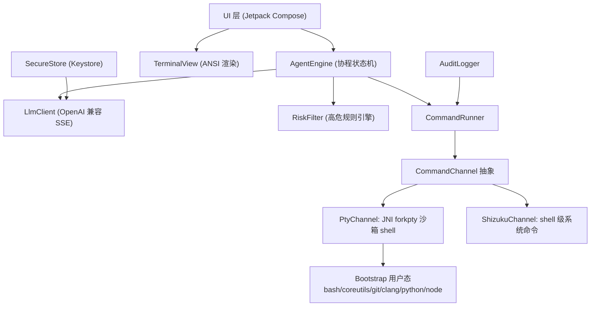

# AI Terminal Autopilot 技术设计

Feature Name: ai-terminal-autopilot
Updated: 2026-08-25

## Description

Android 应用，内嵌 PTY 终端模拟器与预置 Linux 用户态环境（含 clang/git/python/node 工具链）。用户配置任意 OpenAI 兼容模型服务后，Agent 以终端为唯一执行通道，按"规划 → 命令注入 → 输出回读 → 失败修正"循环自动完成编程任务。

核心可行性结论：**无 root 手机执行 shell 无需任何特殊权限**。Android 允许应用在自己的 UID 下 fork/exec 子进程；预置的静态/动态链接命令行二进制解压到应用私有目录后即可直接运行，形成接近完整 Linux 的用户态。更高权限通过 Shizuku（无线调试授权，UID 2000 shell 级）叠加获得。

## Architecture



分层说明：

1. **终端层**：自研 Pty JNI（`forkpty` + `exec $PREFIX/bin/bash`）提供会话；终端模拟与 ANSI 渲染复用 Apache-2.0 许可的 termux terminal-emulator / terminal-view 源码（内嵌至本仓库 `terminal/` 模块，保留版权声明）。
2. **Bootstrap 用户态**：按 ABI 打包预编译二进制 zip（arm64-v8a 优先，来源 termux-packages 构建产物），首启解压到 `{filesDir}/usr`，设置 `PATH/HOME/PREFIX/TMPDIR/LD_LIBRARY_PATH`。
3. **Agent 层**：Kotlin 协程状态机驱动，LLM 通过 OkHttp SSE 流式调用 `/chat/completions`。
4. **权限层**：`CommandChannel` 统一接口屏蔽沙箱/Shell 级差异，自动降级。

## Components and Interfaces

### PtySession（终端层）
- `fun create(cols: Int, rows: Int): Int` — 返回 ptm fd
- `fun write(fd: Int, data: ByteArray)` / `fun read(fd: Int): ByteArray`
- `fun resize(fd: Int, cols: Int, rows: Int)`
- 进程退出回调携带 exit code

### CommandRunner（Agent 层）
- `suspend fun run(channel: CommandChannel, cmd: String, timeoutMs: Long): ExecResult`
- 退出码捕获：注入 `cmd; echo "__EXIT_CODE:$?"__` 并解析标记行
- 输出截断：超过上限时保留头尾各半送入模型上下文

### CommandChannel（权限层）
```kotlin
interface CommandChannel {
    val level: PermissionLevel   // SANDBOX / SHELL
    suspend fun exec(cmd: String): ExecResult
}
```
- `PtyChannel`：写入 PTY 会话，沙箱内执行
- `ShizukuChannel`：`Shizuku.newProcess("/system/bin/sh", ...)`，经 rikka.shizuku API，用于包管理、跨应用文件等系统级操作

### AgentEngine（Agent 层状态机）
```
IDLE → PLANNING → EXECUTING(step i) → OBSERVING
       OBSERVING → EXECUTING(i+1) | REPAIRING | AWAIT_CONFIRM | DONE | PAUSED_LIMIT | STOPPED
```
- 计划输出约束为 JSON 数组（步骤含 command/description/expect）
- REPAIRING：失败信息回传模型获取修正命令，计入迭代轮数
- 轮数上限默认 50（可配）

### RiskFilter
- 规则表匹配高危模式（递归删除系统路径、磁盘写坏块、chmod 777 关键目录、关机重启类等）
- 命中即暂停并弹确认框；用户放行后该规则本任务内记录豁免

### LlmClient / ModelConfig
- 配置项：baseUrl、apiKey、model、temperature
- 密钥存 EncryptedSharedPreferences（Android Keystore 后端）

### PermissionManager
- 三档检测：私有目录恒可用 / `MANAGE_EXTERNAL_STORAGE` 引导页 / Shizuku 绑定 + 无线调试授权引导

## Data Models

| 模型 | 字段 |
|------|------|
| ModelConfig | baseUrl, apiKey, model, temperature |
| Task | id, goal, criteria[], status, createdAt |
| PlanStep | index, command, description, expect, status, exitCode, outputDigest |
| AuditEntry | timestamp, channelLevel, command, exitCode, taskId |

持久化：Task/Audit 用 Room；ModelConfig 用 EncryptedSharedPreferences。

## Correctness Properties

- P1: 任一被注入执行通道的 AI 命令，审计日志中存在一一对应的 AuditEntry
- P2: 高危命令在用户确认动作发生前，状态机保持 AWAIT_CONFIRM
- P3: 自动迭代轮数达到上限时，状态机进入 PAUSED_LIMIT 且停止发起新的模型请求
- P4: apiKey 仅存在于 EncryptedSharedPreferences 与内存，日志与报告输出中脱敏
- P5: STOPPED 语义下，停止请求后的新命令一律不注入通道

## Error Handling

| 场景 | 策略 |
|------|------|
| LLM 网络超时/5xx | 指数退避重试 3 次，仍失败转 PAUSED 并提示 |
| LLM 429 | 遵循 Retry-After 后单次重试 |
| 计划 JSON 解析失败 | 附解析错误重问一次，再失败转 PAUSED |
| PTY 会话进程退出 | 自动重建会话，从断点步骤继续并在报告注明 |
| Bootstrap 解压失败/校验不符 | 阻断终端入口，展示重试按钮 |
| Shizuku 未授权/服务断开 | 自动降级 PtyChannel 并在报告中标注降级 |

## Test Strategy

- **单元测试**：RiskFilter 规则全集、计划 JSON 正常/畸形样本、退出码标记解析、输出截断边界、密钥脱敏格式化
- **仪器测试**：真机 PTY 执行 `echo/ls/git init/clang 编译运行`、多会话创建切换、bootstrap 就绪检查、Room 审计落库
- **Agent 循环集成测试**：MockWebServer 脚本化 LLM 响应序列，覆盖正常完成、失败修正、高危暂停恢复、轮数上限、停止语义五条主链路

## References

[^1]: (Filename#L7-L14) — 现有模块与 SDK 版本基线 `/workspace/app/build.gradle.kts`
[^2]: (Filename) — 需求来源 `.monkeycode/specs/ai-terminal-autopilot/requirements.md`
